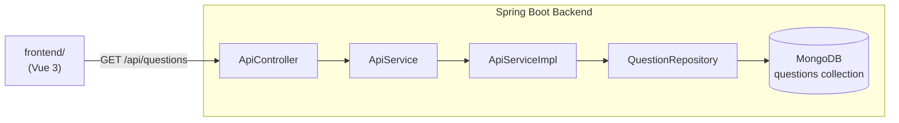

# QuizPlatform · Spring Boot + Vue 3 Quiz Full-Stack

> **Full-stack quiz platform — Spring Boot REST API serving questions from MongoDB + Vue 3 frontend in `frontend/`. Clean layered backend, repository pattern.**
>
> 全栈题库平台：Spring Boot + MongoDB 后端 + Vue 3 前端 (`frontend/`)，仓储模式分层，BO/DTO 隔离存储层与 API 契约。

[English](#english) · [中文](#中文)


---

<a id="english"></a>

## Architecture



## Quickstart

```bash
# Backend
# 1. Start MongoDB (local or Atlas)
# 2. Configure application.properties
mvn spring-boot:run

# Frontend (Vue 3)
cd frontend && npm install && npm run dev
```

### Config (`src/main/resources/application.properties`)

```properties
spring.data.mongodb.uri=mongodb://localhost:27017/vidar
spring.data.mongodb.database=vidar
```

## API

| Method | Path | Response |
|---|---|---|
| `GET` | `/api/questions` | `QuestionsDto` — all questions with options + answer |

## Domain Model

```
Questions (MongoDB document)
├── question  String   question text
├── options   List     answer choices
└── answer    String   correct answer
```

## Technical Highlights

<details>
<summary><b>Repository pattern with Spring Data MongoDB</b></summary>

- **S**: MongoDB document queries need to be decoupled from business logic to stay testable and swappable.
- **A**: `QuestionRepository` extends `MongoRepository<Questions, String>`. `ApiServiceImpl` calls the repository; the controller only handles HTTP concerns. BO/DTO separation (`Questions` BO → `QuestionsDto`) prevents leaking the storage model to the API contract.
- **R**: Swapping the MongoDB collection schema only requires changing the BO; DTO and controller unchanged.
</details>

## Repo Layout

```
src/main/java/com/seal/vidar/
├── controller/ApiController.java      GET /api/questions
├── service/
│   ├── ApiService.java               interface
│   └── impl/ApiServiceImpl.java      MongoDB query logic
├── entity/
│   ├── bo/Questions.java             MongoDB document model
│   └── dto/QuestionsDto.java         API response shape
└── repository/QuestionRepository.java MongoRepository
```

## Roadmap

- [x] `GET /api/questions` — full question bank
- [ ] Question pagination and category filter
- [ ] `POST /api/questions` — admin question upload
- [ ] Score submission and leaderboard endpoints

---

<a id="中文"></a>

## 中文速读

- **是什么**：QuizFrontend 的后端题库 API，Spring Boot + MongoDB，`GET /api/questions` 返回全量题目（题干、选项、答案）。
- **亮点**：BO/DTO 分离隔离存储层与 API 契约，`MongoRepository` 仓储模式使数据层可替换。
- **运行**：配置 `application.properties` 中 MongoDB URI → `mvn spring-boot:run`。

## License

MIT © [Seal-Re](https://github.com/Seal-Re)
